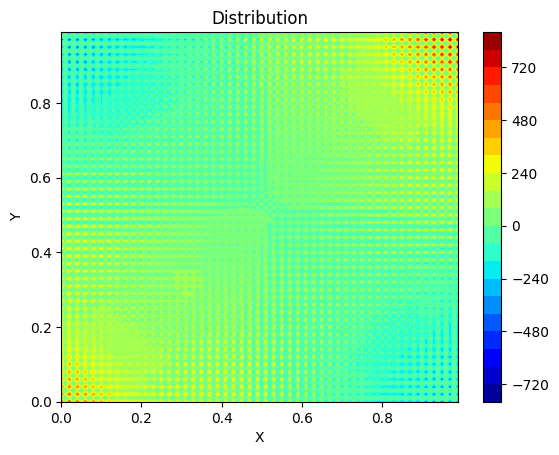
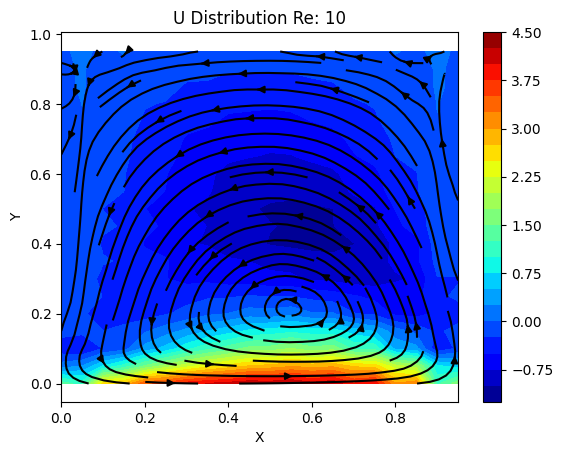
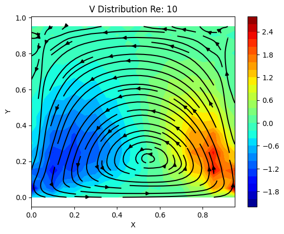
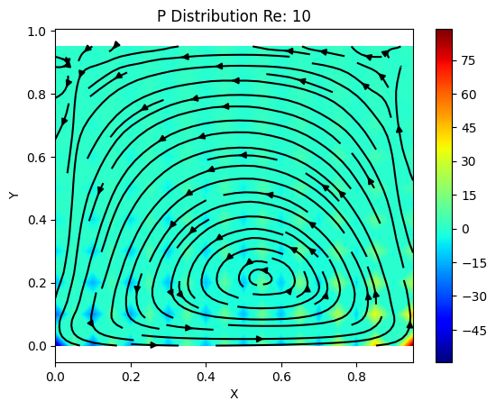
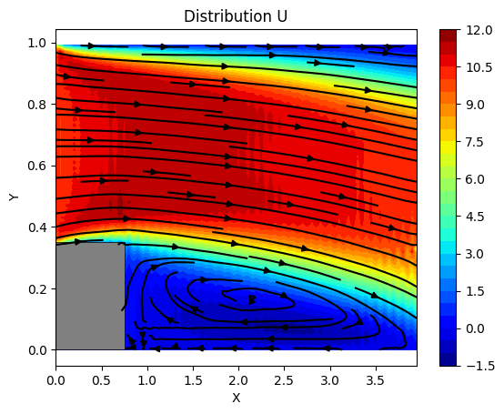
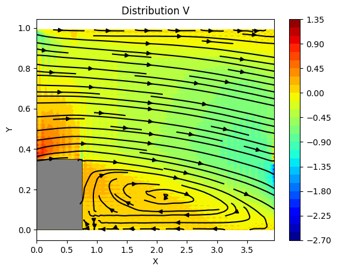
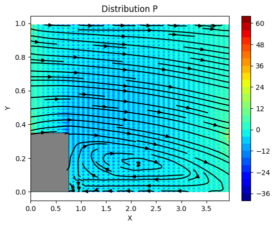

# Artificial Pressure Method for Solving the Navier-Stokes Equations

## Overview

This project implements a finite volume method to solve the Navier-Stokes equations using an artificial pressure approach. The method is applied to the cavity benchmark problem and forward-step benchmark problem. Artificial pressure is introduced to address the decoupling between pressure and velocity fields, prevent pressure oscillations, and allow solving the equations on the same grid without the need for a staggered grid.

## Methodology

The artificial pressure approach modifies the governing equations to maintain stability and ensure a coupled solution for velocity and pressure. A structured Cartesian grid is used, and boundary conditions are enforced at the domain edges. For incorporating solid geometries like a forward-step, a mask function is implemented to distinguish fluid and solid regions. The mask assigns a value of 1 to fluid regions and 0 to solid regions, ensuring that computations are performed only in the fluid domain.

### Mask Function Implementation

A mask matrix is used to represent the domain, where fluid regions have a value of 1 and solid regions have a value of 0. The function `mask_fn` initializes this mask and ensures computations are skipped for solid regions:

```python
def mask_fn(x0_s, x1_s, y0_s, y1_s, u, dx, dy):
    mask = np.ones(u.shape)
    L_x = x1_s - x0_s
    L_y = y1_s - y0_s
    n_start_step_x = round((x0_s - 0) / dx)
    n_start_step_y = round((y0_s - 0) / dy)
    n_end_step_x = round(n_start_step_x + (L_x) / dx)
    n_end_step_y = round(n_start_step_y + (L_y) / dy)

    for i in range(n_start_step_y + 1, n_end_step_y + 1):
        for j in range(n_start_step_x + 1, n_end_step_x + 1):
            mask[i, j] = 0
    return mask, n_start_step_x, n_start_step_y, n_end_step_x, n_end_step_y
```
This function is used to exclude solid regions from the computations, ensuring that equations are only solved in fluid regions.

## Oscillations and Check-Board Pattern with Vanishing Artificial Pressure


As the artificial pressure approaches zero, a check-board pattern emerges in the pressure domain due to the decoupling between the pressure and velocity fields. This pattern, indicative of instability, occurs because the artificial pressure term, which typically stabilizes the coupling between pressure and velocity, is no longer effective. The figure below illustrates this issue, where a stable pressure field is observed with non-zero artificial pressure, while a check-board pattern appears when artificial pressure is reduced to zero.
<p align="center">
  
</p>

## Results
The implementation was tested on the cavity benchmark problem and the forward-step benchmark problem. Below are sample results showcasing velocity and pressure fields.
<p align="center">
  
  
  
</p>
<p align="center">
  
  
  
</p>

